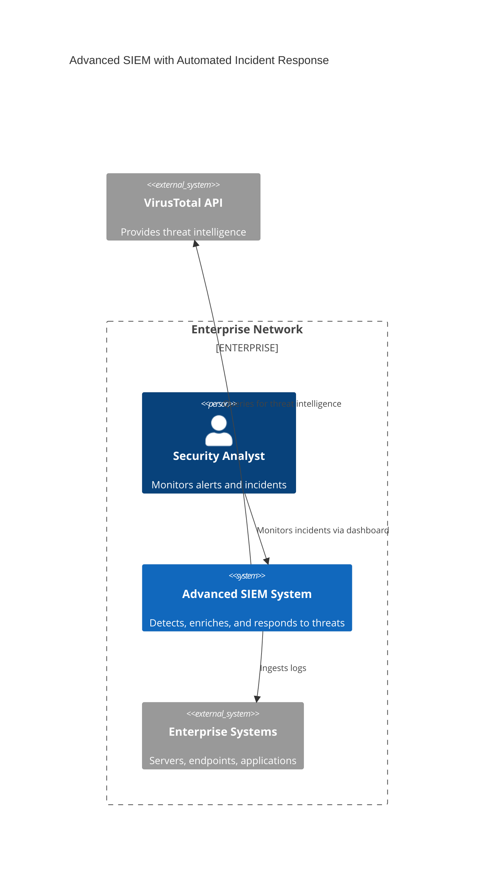
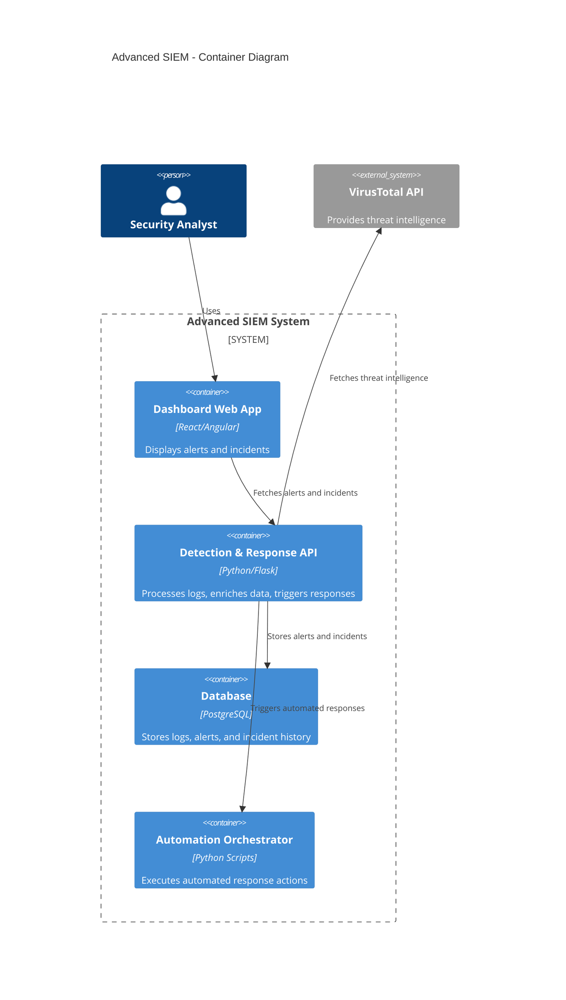

# Advanced SIEM with Automated Incident Response

## Domain
Cybersecurity – Enterprise Security Operations

## Problem Statement
Organizations face increasingly sophisticated cyber threats. While SIEM systems provide detection, they often require manual analyst intervention, slowing down response times. This system enhances SIEM with automation, enabling real-time detection, enrichment via external APIs (VirusTotal), and automated response actions such as device isolation.

## Individual Scope
The project is feasible for one developer because it focuses on simulating log ingestion, anomaly detection, API integration, and automated response workflows. The automation can be modeled with scripts or mock APIs rather than full enterprise deployment.

---

## C4 Diagrams

### Context Diagram




```mermaid
C4Component
title Detection & Response API - Component Diagram

Container_Boundary(apiBoundary, "Detection & Response API") {
  Component(logIngest, "Log Ingestion", "Parses incoming logs")
  Component(ruleEngine, "Rule Engine", "Applies detection rules")
  Component(threatEnrichment, "Threat Enrichment", "Queries VirusTotal API")
  Component(alertService, "Alert Service", "Generates alerts")
  Component(responseEngine, "Response Engine", "Triggers automated actions (e.g., isolate device)")
}

Rel(logIngest, ruleEngine, "Passes parsed logs")
Rel(ruleEngine, threatEnrichment, "Enriches suspicious events")
Rel(threatEnrichment, alertService, "Generates enriched alerts")
Rel(alertService, responseEngine, "Triggers automated response")